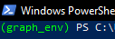

# Biblioteca de Grafos - (Python)

# Requisitos

- Para o funcionamento dessa biblioteca, basta ter o Python - a partir da versão **3.0** - instalada em sua máquina; além do módulo venv ([v. ≥ 3.0](https://docs.python.org/3/library/venv.html)). Responsável pelo provisionamento de um ambiente isolado de execução - de maneira a conter somente o que for necessário às funcionalidades da biblioteca - esse pacote pode ser instalado com auxílio da documentação linkada em sua versão.

# Instalação

- Utilizaremos o gerenciador de pacotes padrão do Python, chamado de **pip**, para realizar o download das dependências do projeto. Tais acervos são facilitadores para a criação de estruturas primitivas, controle de tamanho de dados em bits e optimalidade em termos de memória e performance. As dependências merecedoras de destaque são:
    - numpy (v. ≥ 1.23.3)
    - HeapDict (v. ≥ 1.0.1)
- Em um terminal de comando (PowerShell em sistemas Windows, idealmente), digite:

```bash
git clone https://github.com/RuasGAR/graph_library.git
cd C:/Users/${pasta de destino}

# Para ativar seu ambiente de execução:
	# Linux e Mac
		./graph_env/bin/activate
	# Windows
		.\graph_env\bin\Activate.ps1

# Baixando as dependências

pip install graph_env/requirements.txt
```

- Veja que agora seu terminal dispõe de uma marcação ao lado do caminho de diretório.



- Pronto! Todos os passos já foram dados e agora é só utilizar como quiser! Para uma melhor orientação de como rodar alguns testes, veja a seção “*Caso de Estudos*”.

# Ideação e Estrutura

## Linguagem e Paradigma

- Python é uma linguagem bastante flexível em termos de paradigma, sendo a **orientação a objeto** um de seus destaques mais recentes, em especial no desenvolvimento de APIs simples e leves. Na ampla maioria do código, é essa a abordagem utilizada para o desenvolvimento da biblioteca: os códigos são segmentados como classes e separadas em módulos.


*Estrutura hierárquica do projeto: menores componentes de modularização são as classes*

- Certas escolhas de concepção - cuja totalidade é comentada com mais detalhes na seção *Funcionalidades* - reúnem algoritmos com características similares para evitar sintetizar e reduzir instâncias necessárias. Um exemplo dessa natureza pode ser visto no arquivo “busca.py”, o qual inclui uma classe de Busca. Com somente uma instância dessa classe, podemos escolher o melhor algoritmo de busca para grafos sem peso - Breadth First Search ou Depth First Search.
- Por último - e certamente importante - faz-se importante a exposição do componente básico de praticamente todos os métodos de busca disponíveis na biblioteca. Estamos falando da classe Vertice, disponível no caminho *graph_env/src/data_structures/search_vertex.py*.


## Representação de Grafos

- Nossa biblioteca é capaz de representar grafos não direcionados, com pesos positivos ou com nenhum. Grafos com pesos só podem ser alocados em **Vetores de Adjacência**. Aqueles que não possuem intensidades associadas às arestas também podem ser representados por **Matrizes de Adjacência**, embora sempre tenhamos como recomendação a primeira estrutura de dados para menor consumo de memória e de processamento.

## Otimizações e Boas Práticas

- Por padrão, variáveis e valores inteiros ou de ponto flutuante serão criados com 64 bits pelo Python. Entretanto, em nosso uso corriqueiro, notamos que esse número de alocação de armazenamento é um pouco exagerado: 32 bits já são capazes de representar valores inteiros na casa dos 5 bilhões, enquanto o uso máximo de nossos problemas tinha como limite superior a região dos 10 milhões de vértices. Dessa maneira, fizemos um intensivo uso da biblioteca **numpy** com o intuito de reduzir esse espaço de ocupação e, por consequência, aumentando a eficiência do código para a grande maioria dos casos.
- Para além disso, outra preocupação levantada foi a legibilidade do programa, em especial no que diz respeito ao entendimento de entrada e saída dos métodos e funções. Python não é uma linguagem fortemente tipada, mas não impede que utilizemos módulos como **typing** para tornar mais transparente as expectativas de um código. Essa estratégia, apesar de verborrágica, facilita o debugging, os mecanismos de *hint* das IDEs mais populares e viabiliza de forma mais clara a colaboração da comunidade na elaboração do projeto.

# Formato(s) de Entrada

- Até o momento (v_tal), a biblioteca permite o processamento de grafos não direcionados com pesos e sem pesos. O formato de entrada aceito pela biblioteca é bem similar nos dois casos, diferindo somente pela presença de um valor a mais quando as arestas possuem pesos. A escolha foi orientada pelo padrão acadêmico mais comum axs pesquisadorxs da área.


Sem peso


Com peso

Um arquivo .txt deve ser fornecido nos seguintes formatos:

- *Primeira linha*: nº de vértices
- *Da segunda linha em diante*: arestas codificadas em seus vértices incidentes, separados por um espaço.
- *Caso o grafo tenha pesos*, um terceiro valor (de ponto flutuante ou inteiro) pode ser incluído em cada aresta, a ser preenchido com um espaço de distância em relação aos vértices.

# Como usar (foco nos estudos de caso)

- Em cada parcela do desenvolvimento da lib foram rodados estudos para averiguar a complexidade, viabilidade, qualidade e assertividade dos métodos implementados. Por uma questão de organização, desenvolvemos scripts relativos a cada uma das partes para enxugar a main.


- Dessa maneira, se quisermos verificar os resultados da “Questão 3” da parte 2, basta fazer o import do script relacionado. A parte 1 tem maior incidência de prints no terminal de execução como saída e monitoramento do programa, enquanto a parte 2 é um pouco mais inteligente, originando arquivos com as respostas correspondentes para cada grafo. Tais saídas podem ser encontradas no caminho *graph_env/src/estudos_de_caso/grafos_parte2/outputs*. E não se preocupe caso essa pasta não apareça de início: se esse for o caso, qualquer execução da parte 2 já criará o diretório automaticamente.
    - *Observação: todas as questões da parte 2 foram implementadas dessa maneira, tendo somente o caminho para armazenamento dos outputs como parâmetro. As da primeira exigem um pouco mais de desenvoltura com o estado do código.*


# Funcionalidades

## Parte 1

Focada especialmente em grafos sem pesos, essa parcela da biblioteca fornece os algoritmos de base no estudo de Grafos. Além disso, também é possível investigar características relevantes do grafo inserido, como o seu grau mínimo.

As funcionalidades implementadas, **para grafos não direcionados e sem pesos**, são:

- Obtenção de grau mínimo, máximo, médio e da mediana do grau de um grafo sem pesos não direcionado.
- Fornecimento de número de arestas e de vértices de um grafo sem pesos não direcionado.
- BFS e DFS → completas, essas formas de busca têm como principal diferença a garantia de optimalidade em cenários finitos: enquanto a primeira garante o encontro do melhor caminho, a segunda é sensível a estruturas com loops e, portanto, pode não encontrar a melhor trajetória de um vértice ao outro. A BFS utiliza filas em sua implementação, enquanto a DFS faz uso de pilhas.
    - O time de desenvolvimento da linguagem Python oferece uma biblioteca de estruturas primitivas chamada **collections,** a qual contém uma estrutura chamada de **[deque.](https://www.geeksforgeeks.org/deque-in-python/)** Apelido de *double ended queue,* esse construto pode ser utilizado tanto como filas (FIFO) como stacks (FILO), já que podemos escolher adicionar ou retirar itens no início ou no fim da estrutura.
- Identificação de componentes conexas, bem como a quantificação dos vértices em cada uma delas. Utiliza BFS como base.

## Parte 2

A etapa 2 consiste na extensão dos principais objetivos de análise em um grafo para instâncias que tenham pesos positivos. Introduzindo técnicas de paradigmas gulosos, podemos agora calcular o custo de percorrer determinado caminho, bem como determinar conjuntos de vértices cuja que sejam alcançáveis entre si.

Mais especificamente, você poderá utilizar os seguintes algoritmos:

- Dijkstra, implementado com vetor de distâncias → com complexidade O(n²), a versão tradicional desse famoso algoritmo é capaz de identificar o custo de todos os outros nós para um ponto de partida escolhido pelo usuário. No entanto, deve-se ter cautela com seu uso: para grafos muito grandes, sua complexidade pode ser impeditiva, seja em termos de memória, seja de processamento (principalmente).


*Estruturas auxiliares para o algoritmo de Dijkstra com vetor*

- Dijkstra, implementado com fila de prioridade → instanciadas como heap, as filas de prioridade nos possibilita o acesso e extração de mínimos em tempo O(1) e O(log n), respectivamente. Ambas são bem menores do que a complexidade de acesso do vetor, que no pior caso exige uma passagem por todos os n vértices disponíveis. Dessa forma, a complexidade total de Dijkstra torna-se O((n+m) log n), o que é menor do que n² *em casos de grafos de baixa densidade*.
    - Por se tratarem de estruturas básicas na computação, a heap possui inúmeras implementações disponíveis em forma de biblioteca para uma grande gama de linguagens. O algoritmo de Dijkstra requer que tenhamos o poder de alterar o custo de um determinado nó, o que significa alterar a estrutura global como um todo. A biblioteca encontrada para tal finalidade foi a [HeapDict](https://pypi.org/project/HeapDict/), que mistura dicionários com as operações de **decrease-key** e **extract** min das heaps.
    
    
    
    Exemplo de utilização da HeapDict.
    Aqui são criados 10 itens na heap, cujas chaves são os identificadores de vértices e o valor, seu custo associado.
    
- Árvore geradora mínima, utilizando o algoritmo de Prim: muito similar a Dijkstra, o algoritmo de Prim é capaz de obter os subgrafos nos quais os nós estão todos conectados, assegurando uma das configurações possíveis de se obter essa propriedade com o menor custo possível. Foi implementada usando a estratégia de heaps.


Em destaque, podemos ver o fator de disparidade com Dijkstra: na exploração de vértices, não nos preocupamos com o menor custo acumulado, mas sim com aquele que garante o menor próximo passo. No exemplo, se a distância conhecida para um vértice for maior do que a distância de u a esse mesmo nó, então devemos substituir o custo associado, e atualizar seu parentesco.

## Parte 3

### Introdução

O algoritmo de foco da vez é o Ford Fulkerson, utilizado para encontrar soluções de fluxo máximo em redes de capacidades discretas. Para a implementação dessa técnica, algumas novas features precisaram ser elaboradas ou incluídas como alternativas de caminho em funcionalidades previamente feitas. Algumas dessas escolhas podem aumentar o número de instruções em determinados passos, mas não afetam a complexidade geral da solução. 

Agora, arestas e vértices de vizinhança (em uma lista de adjacência) podem ter mais informação do que apenas o peso - a exemplo de fluxo passante ou marcação de originalidade (em grafos residuais). O algoritmo principal, cujo pseudo-código é bem abstrato, foi adaptado de maneira segmentada em diferentes funções, baseadas severamente na passagem de parâmetros por referência características do Python. 

### Como utilizar

Após fazer o clone do projeto, os grafos disponibilizados pelo professor no site [https://www.cos.ufrj.br/~daniel/grafos/](https://www.cos.ufrj.br/~daniel/grafos/) devem ser agregados em uma pasta de nome “*inputs*”, a qual, por sua vez, será alocada na pasta (do projeto) de caminho *graph_env/src/estudos_de_caso/grafos_parte3/inputs.* A estrutura de arquivos deve ficar como a apresentada na imagem a seguir:


### Grafos Direcionados, Residuais e Overloading

Inicialmente, poderíamos somente adaptar o método de construção do vetor de adjacência para que recebesse uma flag da leitura do arquivo, indicando direcionamento ou não, como foi feito com o peso na etapa anterior. Contudo, ao longo do desenvolvimento do projeto, ficou claro que seria uma estratégia simplória e confusa reunir todos os formatos diferentes de um grafo em um só método construtor.  Esse fator, junto com as particularidades de redes de fluxo e de grafos residuais, fez com que optássemos então pelo uso de uma abordagem adaptada, utilizando **[Constructor Overloading](https://www.geeksforgeeks.org/constructor-overloading-c/).**  

Como nosso vetor de adjacências (**VetorAdj**) pode ter arestas de formatos diferentes, nós utilizamos um recurso do Python muito parecido com essa estratégia, adicionando um [decorator](https://www.geeksforgeeks.org/decorators-in-python/) (um modificador de funções e classes, em resumo) chamado de **[classmethod](https://www.programiz.com/python-programming/methods/built-in/classmethod).**


Diagrama em formato livre para entendimento de como todos esses grafos, mesmo com informações diferentes, são da mesma classe. 
**Cada um terá uma função particular decorada com “classmethod”, mas todos irão originar a mesma classe**

Vejamos o exemplo a seguir, no código da estrutura presente em *adjacency_vector.py*.


Exemplo de método “decorado” com classmethod. O retorno de uma função dessas é sempre a chamada do construtor da classe relacionada

Primeiro de tudo, se estamos familiarizados com Python, podemos ver de cara que esse não é um método construtor - e de fato, não o é, o que inclusive faz com que a repetição de métodos assim não configure um equivalente ao overloading de construtores. 

A forma mais tranquila de entender esse recurso é pensar na ideia de pré-processamento: podemos ter objetos com características levemente diferentes, que demandam tratamentos específicos, mas que resultarão numa estrutura abstrata similar. 

Perceba que esse método recebe como parâmetro a própria classe (**cls**), e retorna justamente a sua chamada de construção, cuja rotina segue abaixo:

 


Construtor da classe VetorAdj. Recebe os parâmetros de métodos com a anotação “classmethod”

Dessa forma, a construção da classe pode ser alterada conforme o uso que desejamos utilizar. Porém, essa intenção deve ser explícita, como no trecho de código abaixo:

```python
# Anteriormente
grafo = VetorAdj(num_vertices, arestas, tem_pesos=False)

# Agora
grafo_tradicional = VetorAdj.formato_tradicional(num_vertices,arestas,tem_pesos=False)

grafo_residual = VetorAdj.formato_residual(num_vertices, arestas)

grafo_com_fluxo = VetorAdj.formato_com_fluxo(num_vertices, arestas)
```

### Mais OO: Herança

Dada a natureza da lista/vetor de adjacência, as arestas acabam sendo mapeadas pelas características embutidas na vizinhança dos vértices. Se estamos olhando o vértice 2 e ele é vizinho de 4, por exemplo, seu registro precisa ter consigo o peso que precisamos pagar para ir do 2 ao 4. Esse aspecto é importante porque nossa BFS - feita lá no primeiro trabalho, há alguns meses - utilizava uma estrutura que chamamos de Vertice. Cada nó era uma instância desse formato, e continha informações sobre pai, peso, nível, etc. 

Com grafos residuais, para respeitar as regras e podermos usar a mesma BFS com a menor quantidade de alterações possível, nós tivemos de fazer um **Vertice_Residual**, que herda do Vertice e introduz mais um atributo: o de originalidade de uma aresta. Se esse valor for verdadeiro, então a aresta percorrida é original; do contrário, ela é reversa. Ela também recebe um override no método mágico de representação, utilizado para casting em strings (o que inclui o print).


Código de herança básica utilizada para vértices com características mais específicas

### Ford Fulkerson: *sabendo que 1+1 é 2, fatore a integral da Faixa de Moebius*

Esse algoritmo é um tanto simplista quando olhamos apenas para seu passo a passo: cada uma de suas instruções representa um conjunto de funcionalidades mais complexas.

Tendo isso em mente, segmentamos nosso código em diversas funções auxiliares, identificadas e descritas na tabela abaixo.

| Ordem de Exec | Função | Descrição | Chamada por |
| --- | --- | --- | --- |
| 1 | ford_fulkerson (grafo_original, fonte, destino) | Executa o passo a passo tradicional do pseudo código apresentado pelo professor | Usuário |
| 2 | construir_residual (grafo_original) | Cria um novo grafo, com arestas originais e reversas | ford_fulkerson |
| 3 | encontrar_caminho_e gargalo (grafo_residual, fonte, destino) | Instancia a classe Busca e executa uma BFS. Pega todos os vértices e utiliza indexação para reconstruir o caminho. | ford_fulkerson |
| - | - | ENTRADA NO LOOP DE CAMINHO MÍNIMO | - |
| 4 | atualizar_grafos ( grafo_original, grafo_residual, gargalo, caminho_min ) | Para grafos originais, atualiza o fluxo passante pelas arestas. Para residuais, atualiza a capacidade de arestas diretas e reversas. É talvez o método mais complexo e certamente deveria ser separado também (no futuro).  | ford_fulkerson |
| 5  | encontrar_arestas(grafo, original, meta) | Esse método é o que acrescenta 3 x (g max) no processamento: precisamos buscar as arestas em suas posições de vizinhança. Recebe um grafo original ou residual, indicado pelo parâmetro original, e retorna uma ou duas arestas (direta e reversa), respectivamente. Meta é a aresta do caminho, em formato (v1,v2, capacidade, original_ou_reversa) | atualizar_grafos( ), 2 vezes para cada aresta do caminho. Uma para original e uma para residual (que precisa buscar 2 arestas sempre) |
| 6 | encontrar_caminho_e_gargalo ( mesmos parâmetros ) | Com os grafos atualizados, buscamos a existência de novos caminhos mínimos | ford_fulkerson |